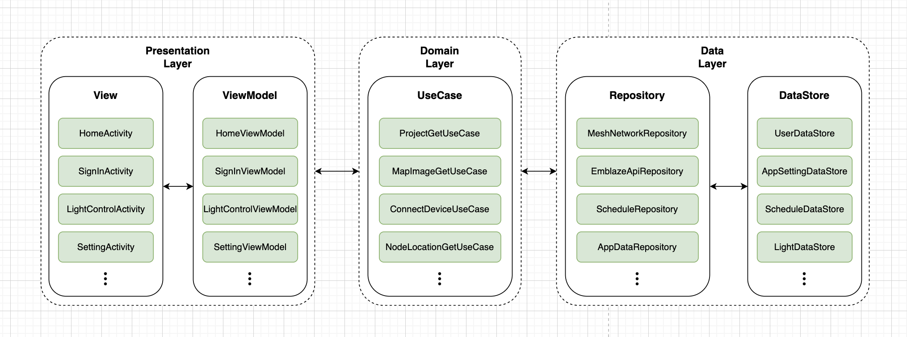
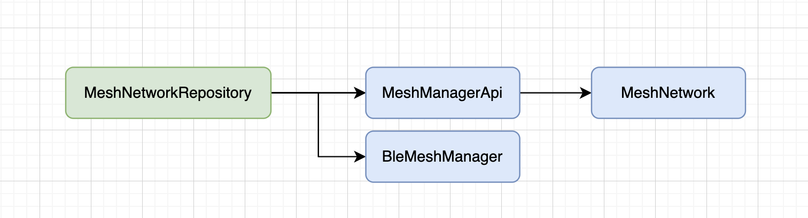
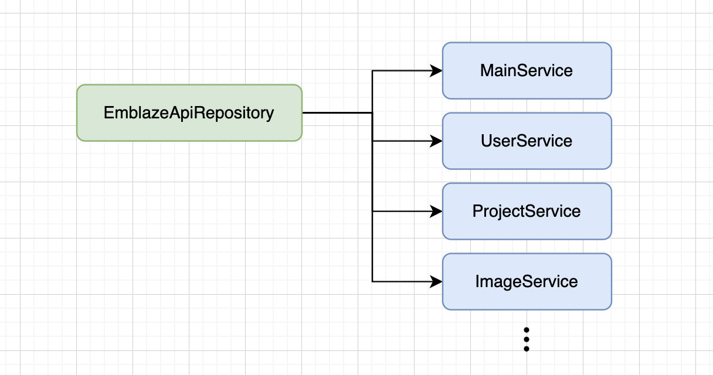
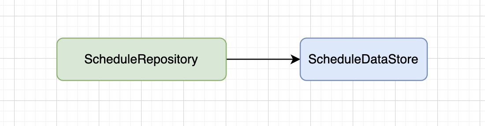
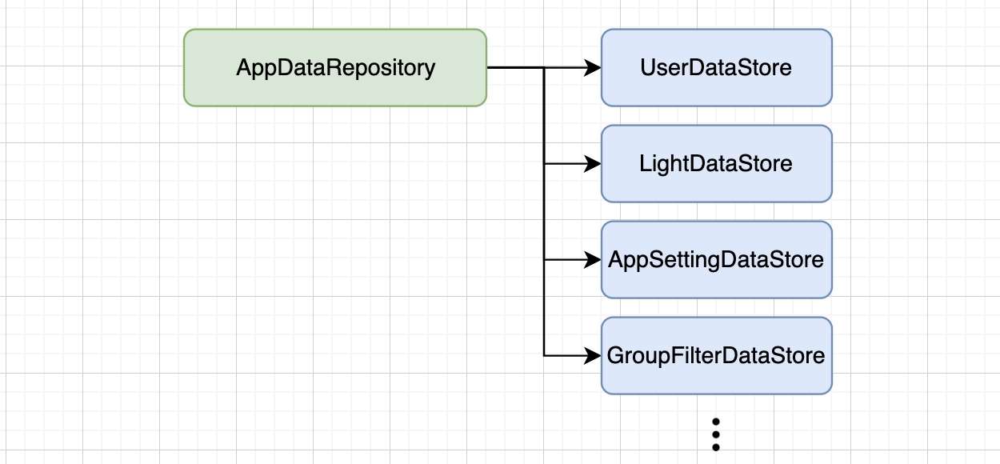

# 앱 아키텍쳐 및 구조 설명

### 앱 구조

&nbsp;
---

### MeshNetworkRespository
BleMeshManager와 MeshManagerApi의 콜백 인터페이스를 오버라이딩하여 Bluetooth 메세지를 메시 프로토콜 메세지로 변환 처리

&nbsp;
---

### EmblazeApiRepository
네트워크 통신에 필요한 각 서비스별 요청 메소드 관리

&nbsp;
---

### ScheduleRepository
조명 제어 스케줄 데이터 관리

&nbsp;
---

### AppDataRepsoitory
앱 기본 설정 및 글로벌 데이터 관리

&nbsp;