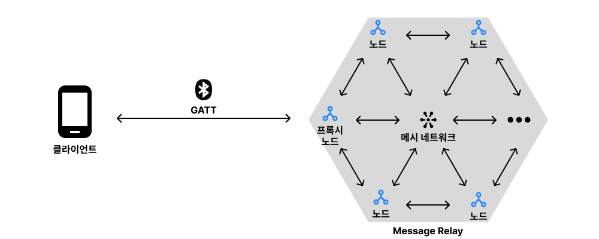

# BLE Mesh 기술적 특징

**1. 네트워크 구성 요소**
* **클라이언트**: 프록시 노드와 직접 GATT(Bluetooth Generic Attribute Profile) 연결을 통해 통신하는 역할을 합니다.
* **프록시 노드**:
  * 클라이언트와 BLE GATT를 통해 직접 연결됩니다.
  * 메시 네트워크 내에서 중개자 역할을 수행하며, 클라이언트가 전송한 메시지를 주변 노드에 전달합니다.
* **노드**:
  * 메시 네트워크에 프로비저닝(provisioning)된 장치로, 다른 노드와 직접 통신합니다.
  * 프록시 노드로부터 받은 메시지를 다른 노드로 전달할 수 있습니다.

⠀**2. 네트워크 동작 방식**
* **연결(GATT Connection)**:
  * 클라이언트는 프록시 기능을 지원하는 노드와 BLE GATT를 통해 직접 연결됩니다.
* **메시지 릴레이(Message Relay)**:
  * 프록시 노드는 클라이언트로부터 받은 메시지를 네트워크 내 모든 인접 노드에 전달합니다.
  * 메시지를 받은 노드는 다시 다른 노드로 메시지를 전달하여 네트워크 전체에 전파됩니다.
  * 이러한 방식으로 클라이언트의 명령이 네트워크 내 모든 노드에 전달될 수 있습니다.

&nbsp;
&nbsp;