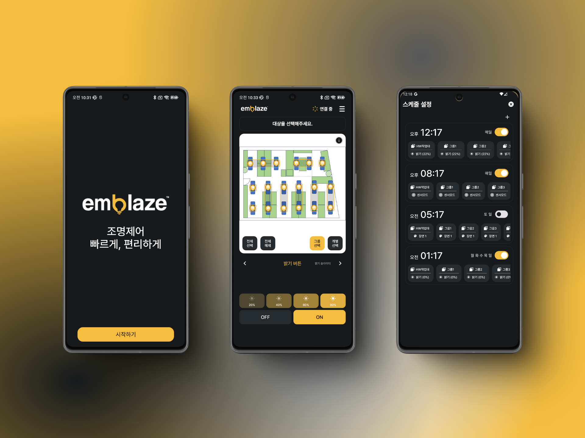

# ✨ emblaze

### emblaze는 조명 제어 도구로, 사용자가 손쉽게 조명을 관리할 수 있도록 지원합니다.

emblaze는 [BLE Mesh](./BLE_MESH.md) 네트워크를 기반으로 한 스마트 조명 제어 솔루션입니다.대규모 시설에서도 간단한 무선 네트워크를 활용하여 효율적인 조명 제어가 가능합니다.

⠀📌 주요 기능
* **조명 개별 및 그룹 제어**
* **조명 설정 변경 및 저장**
* **조명 제어 스케줄링**
* **도면 UI를 통한 직관적인 사용성 제공**

⠀🔐 요구 권한
* **위치 액세스**: IoT 장치를 검색하기 위해 사용
* **근처 기기 액세스**: IoT 장치와 BLE Mesh 네트워크 연결

&nbsp;

# 🛠️ 개발 환경
* **IDE**: Android Studio
* **SDK Version**:
  * minSdkVersion : 25 (Android 7.1, Nougat)
  * targetSdkVersion : 34 (Android 14)

&nbsp;

# 📚 기술 스택
### 📌 언어 & 프레임워크
* **Kotlin**

⠀🔄 비동기 처리
* **RxJava**
* **Coroutine**
* **Flow**

⠀🌐 네트워크 통신
* **Retrofit**

⠀⚙️ 의존성 주입
* **Hilt**

⠀💾 데이터 저장소
* **Room** (로컬 데이터베이스)
* **Preference DataStore** (설정 데이터 저장)

⠀📊 상태 관리 & UI
* **ViewModel**
* **LiveData**

⠀🖼️ 이미지 로딩
* **Glide**

&nbsp;

# 앱 주요 기능

## 홈 화면 (도면)

&nbsp;

도면에서 조명을 선택할 수 있습니다. 사용자는 제스처를 통해 도면을 확대하거나 이동할 수 있으며, 도면 위의 조명을 터치하여 선택할 수 있습니다. 또한, 그룹 선택과 개별 선택 방식을 전환하여 그룹 또는 개별 조명을 자유롭게 선택할 수 있습니다.

&nbsp;

## 홈 화면 (슬라이딩 패널)

&nbsp;

슬라이딩 패널을 통해 다양한 기능을 제공합니다. **메뉴 변경** 탭에서는 노출되는 탭의 개수와 순서를 사용자가 직접 설정할 수 있습니다. 각 탭에서 제공하는 기능은 다음과 같습니다:
- 밝기 버튼
- 밝기 슬라이더
- 장면
- 센서
- 색온도
- 모터 제어
- 도면 설정
- 메뉴 변경

&nbsp;

## 밝기 버튼 설정

&nbsp;

조명 밝기 제어 시, 홈 화면에서는 현재 밝기가 그라데이션 애니메이션으로 표현됩니다. 밝기 버튼은 기본적으로 [20%, 40%, 60%, 80%, ON, OFF]로 제공되며, 상단의 네 개 버튼은 각각 0%에서 100% 사이의 값으로 사용자가 자유롭게 설정할 수 있습니다. 이를 통해 원하는 밝기를 직관적으로 조정할 수 있습니다.

&nbsp;

## 장면 설정

장면 제어 시, 각 조명에 대해 실행할 장면의 상태를 설정할 수 있습니다. 먼저 적용할 보조장면을 선택하고, 도면에서 설정할 조명을 선택한 후 설정을 진행합니다. 각 조명에 대한 설정은 비동기적으로 처리되어, 동시에 여러 조명에 대한 장면 적용이 가능합니다.

&nbsp;

## 그룹 설정

&nbsp;

조명의 그룹을 설정할 수 있습니다. 먼저 조명을 선택한 후, 해당 조명을 그룹화할 그룹을 선택하여 설정을 진행합니다. 각 조명에 대한 그룹 설정은 비동기적으로 처리되어, 여러 조명을 동시에 그룹화할 수 있습니다.

&nbsp;

## 스케줄 설정

&nbsp;

특정 시간에 동작할 조명 제어 방식을 설정할 수 있습니다. 제어 가능한 동작은 다음과 같습니다
- 밝기(0%~100%)
- 센서 모드
- 장면 1
- 장면 2

&nbsp;

# 앱 아키텍쳐 설계
[앱 아키텍쳐 설계 내용 보기](./ARCHITECTURE.md)

