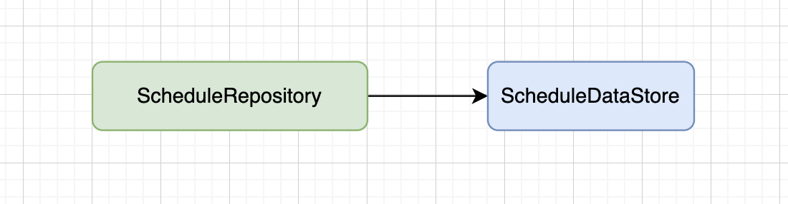
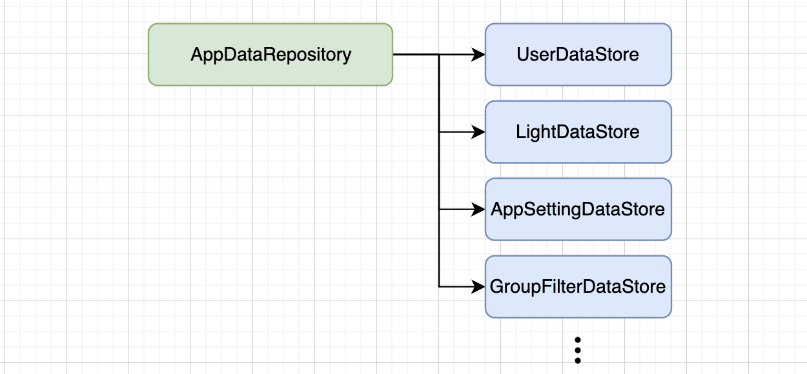

# 📌 emblaze

**emblaze**는 **BLE Mesh 네트워크**를 기반으로 한 **스마트 조명 제어 솔루션**입니다.대규모 시설에서도 **간단한 무선 네트워크**를 활용하여 **효율적인 조명 제어**가 가능합니다.
### emblaze는 조명 제어 도구로, 사용자가 손쉽게 조명을 관리할 수 있도록 지원합니다.
* **조명 개별 및 그룹 제어**
* **설정 변경 및 저장**
* **편리한 UI를 통한 직관적인 사용성 제공**

⠀🔐 요구 권한
* **위치 액세스**: IoT 장치를 검색하기 위해 사용
* **근처 기기 액세스**: IoT 장치와 BLE Mesh 네트워크 연결

&nbsp;

## ScreenShot
스크린샷 첨부

&nbsp;

# 🛠️ 개발 환경
* **IDE**: Android Studio
* **SDK Version**:
  * minSdkVersion : 25 (Android 7.1, Nougat)
  * targetSdkVersion : 34 (Android 14)

&nbsp;

# 📚 기술 스택
### 📌 언어 & 프레임워크
* **Kotlin**

⠀🔄 비동기 처리
* **RxJava**
* **Coroutine**
* **Flow**

⠀🌐 네트워크 통신
* **Retrofit**

⠀⚙️ 의존성 주입
* **Hilt**

⠀💾 데이터 저장소
* **Room** (로컬 데이터베이스)
* **Preference DataStore** (설정 데이터 저장)

⠀📊 상태 관리 & UI
* **ViewModel**
* **LiveData**

⠀🖼️ 이미지 로딩
* **Glide**

&nbsp;
&nbsp;

# BLE Mesh 기술적 특징

**1. 네트워크 구성 요소**
* **클라이언트**: 프록시 노드와 직접 GATT(Bluetooth Generic Attribute Profile) 연결을 통해 통신하는 역할을 합니다.
* **프록시 노드**:
  * 클라이언트와 BLE GATT를 통해 직접 연결됩니다.
  * 메시 네트워크 내에서 중개자 역할을 수행하며, 클라이언트가 전송한 메시지를 주변 노드에 전달합니다.
* **노드**:
  * 메시 네트워크에 프로비저닝(provisioning)된 장치로, 다른 노드와 직접 통신합니다.
  * 프록시 노드로부터 받은 메시지를 다른 노드로 전달할 수 있습니다.

⠀**2. 네트워크 동작 방식**
* **연결(GATT Connection)**:
  * 클라이언트는 프록시 기능을 지원하는 노드와 BLE GATT를 통해 직접 연결됩니다.
* **메시지 릴레이(Message Relay)**:
  * 프록시 노드는 클라이언트로부터 받은 메시지를 네트워크 내 모든 인접 노드에 전달합니다.
  * 메시지를 받은 노드는 다시 다른 노드로 메시지를 전달하여 네트워크 전체에 전파됩니다.
  * 이러한 방식으로 클라이언트의 명령이 네트워크 내 모든 노드에 전달될 수 있습니다.

&nbsp;
&nbsp;

# 앱 아키텍쳐 및 구조 설명

### 앱 구조

&nbsp;
---

### MeshNetworkRespository
BleMeshManager와 MeshManagerApi의 콜백 인터페이스를 오버라이딩하여 Bluetooth 메세지를 메시 프로토콜 메세지로 변환 처리

&nbsp;
---

### EmblazeApiRepository
네트워크 통신에 필요한 각 서비스별 요청 메소드 관리

&nbsp;
---

### ScheduleRepository
조명 제어 스케줄 리스트 관리

&nbsp;
---

### AppDataRepsoitory
앱 기본 설정 및 글로벌 데이터 관리

&nbsp;